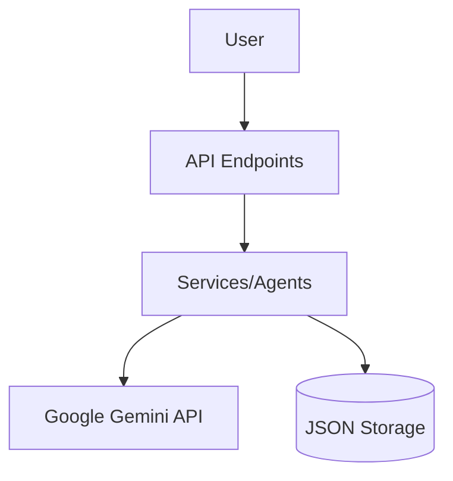

# CareerCompass AI

CareerCompass AI is a production-ready application for analyzing resumes and providing career guidance using AI agents.

## Architecture


## Setup & Running

### Prerequisites
- Docker & Docker Compose

### Running with Docker
```bash
docker compose up --build
```
The API will be available at `http://localhost:8000`.

### Setup Locally
1. `pip install -r requirements.txt`
2. Create `.env` from `.env.example`.
3. `uvicorn app:app --reload`

## Project Structure
- `api/`: API endpoints
- `agents/`: AI agent logic
- `services/`: Business services
- `models/`: Data models
- `core/`: Core utilities
- `data/`: Local storage
- `docs/`: Documentation

## Engineering Principles
- Clean Architecture
- SOLID principles
- Modular design
- Robust logging & error handling

## API List
- `POST /api/analyze-resume`: Resume analysis
- `POST /api/match-jobs`: Job matching
- `POST /api/career-advice`: Career advice
- `POST /api/learning-roadmap`: Learning roadmap
- `POST /api/interview-coach`: Interview coaching
- `POST /api/career-report`: Unified career report
- `POST/GET /api/profile`: User profiles

## Screenshots
*(Placeholder: Add screenshots of the career report generation here)*
